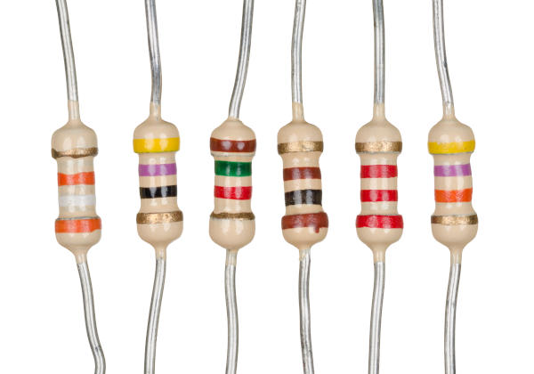
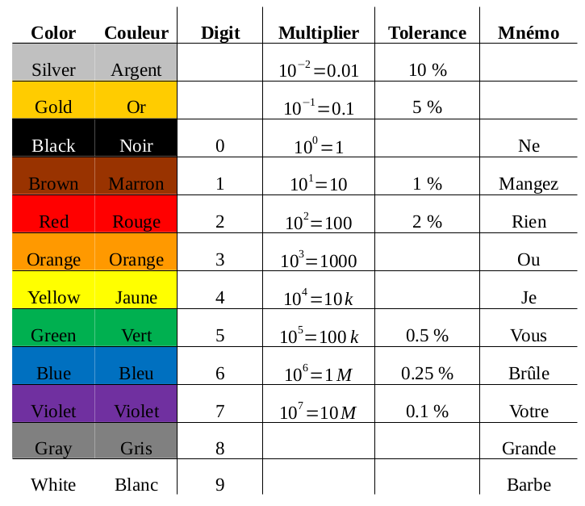
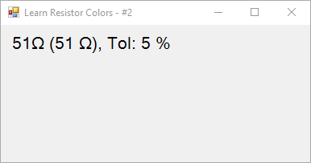
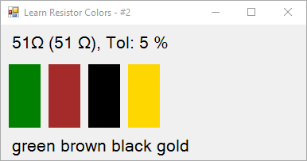
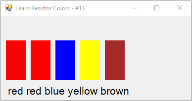
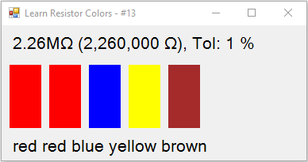

# Learn Resistor Colors

This tool is used as a drill (exercise) to learn how to read the value of a resistor.  A resistor is a small electrical component that you find on virtually all circuit boards.  They limit the current flow.

Here is an image (from [Wikipedia](https://en.wikipedia.org/wiki/Resistor)):

Resistors come with a fixed value, expressed in Ohms, for example 100 Ohms, 10k Ohms or 233M Ohms.  The value is not written on the resistor, it is represented with color bands.

Most resistors have 4 or 5 bands.  The last one, separated from the others by a small gap, is the "tolerance", that is the possible difference between the actual (the one of this particular resistor) and the nominal, or theoretical (the one you find with the color bands) values.  The tolerance may be 1, 2, 5 or 10%.  The more precise the resistor is, the more expensive it is.

The other bands represent the value.  Each color is a number:

There are several mnemonics to remember the color.  For example: "Bad Beer Rots Our Young Guts But Vodka Goes Well. Get Some (Now)!".  In French: "Ne Manger Rien Ou Jeûner, Voilà Bien Votre Grande Bêtise." or "Ne Mangez Rien Ou Je Vous Brûle Votre Grande Barbe".

<ul>
<li>The first band is the first significant digit (surprising, isn't it?).</li>
<li>The second band is the second significant digit (even more surprising).</li>
<li>The third band is the multiplier.</li>
</ul>

See examples below.

This is for a 4 band resistor.  For a 5 band resistor, the third band is the third significant digit, and the multiplier is found in the fourth band.

The program is just a drill.  It present you either a value and a tolerance (in this case, you must find the colors of the bands):

whith the answer:

or a set of bands (and you must find the value and tolerance):

whith the answer:

Press space or click on the window to get any of these questions, or B to get band question, or V to get a value question.  Press any key to get the answer.  To quit, just close the window.

The question are presented at random.

## Getting Started

To compile, download the source and open the project (`.csproject`) in Microsoft Visual Studio.

You can download the compiled binaries for Window on [boberle.com](http://boberle.com/projects/learn_resistor_colors/).

## Prerequisites

The program runs on the .Net framework 4.5.  Depending on the version of windows, you may need to install it.

## License

Copyright 2011 Bruno Oberle

This software is released under the terms of the MIT License.  See the LICENSE file for details.  This program comes with ABSOLUTELY NO WARRANTY.
